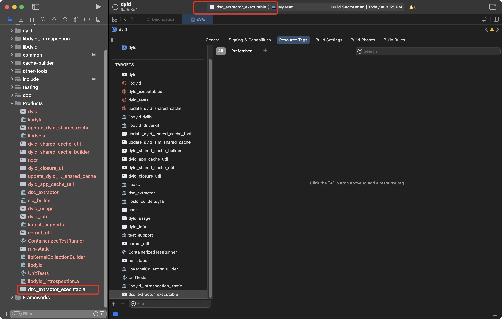
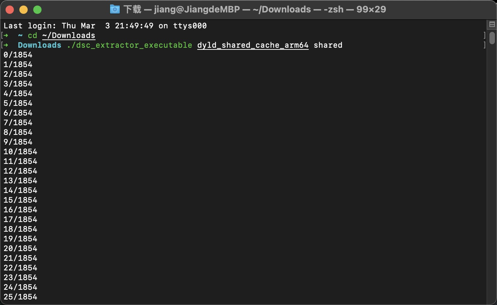

# How to use it

open dyld.xcodeproj, then choose 'dsc_extractor_executable' as compile target

then you can use it to extract :

# Thanks

1. [iOS 崩溃日志在线符号化实践](https://mp.weixin.qq.com/s/MIun-eV4_J1hXGDRjGoLaw?scene=25#wechat_redirect)
2. [Extract the system libraries on macOS Big Sur](https://lapcatsoftware.com/articles/bigsur.html)